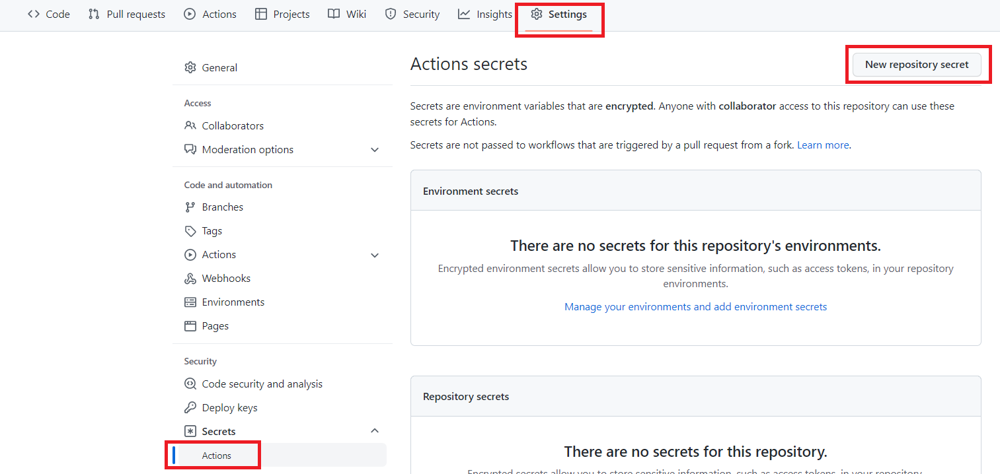
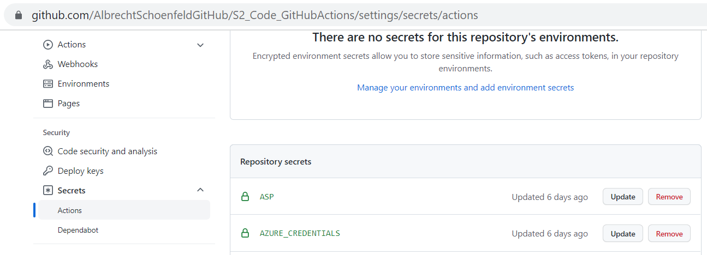
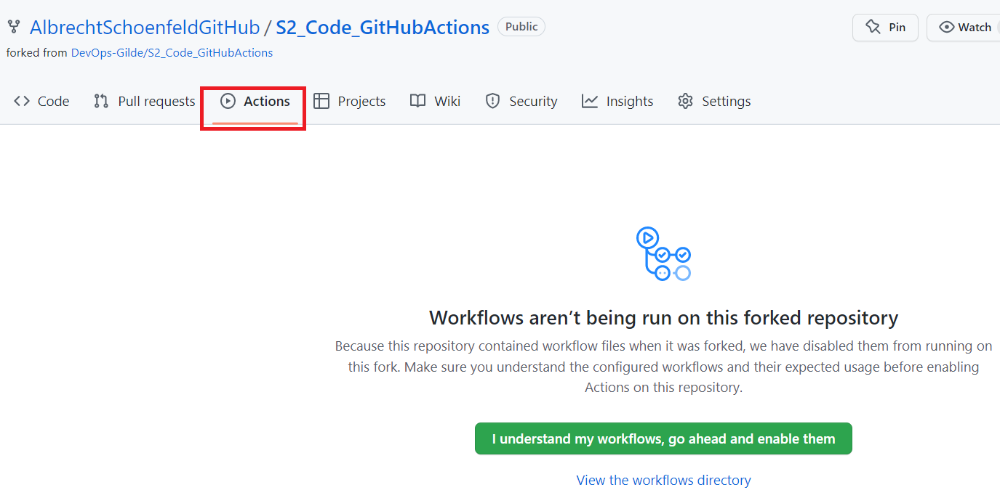
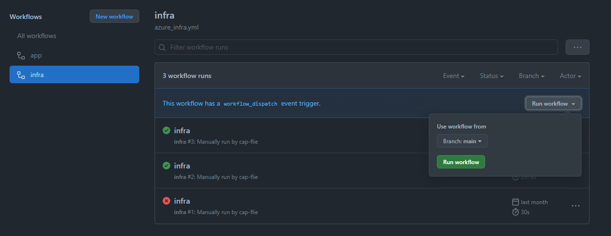
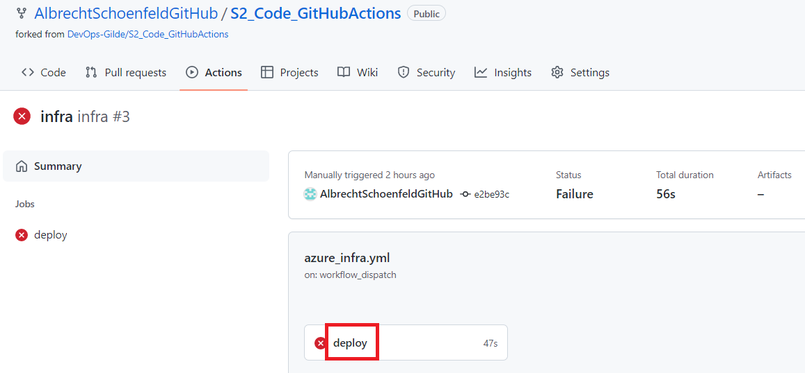
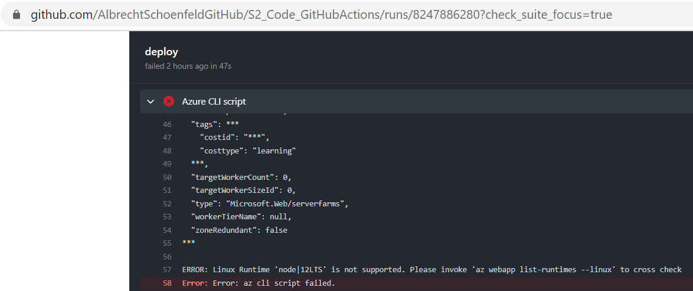

# 1. Introduction to the Infrastructure Workflow

You should now have Completed the Following things:
1. Setup your GitHub Account
2. Setup your Git Repository

Next you will create your own workflows to setup the azure services required for your Website on Azure. We will use the GitHub Repository to host the code for our workflows. A workflow consists of separate steps so called actions. Hence the name GitHub Actions. Workflows are the counterpart of Azure DevOps pipelines if you joined our previous session.

If you want to learn more about the concept of a workflow you can do it here:

[https://docs.github.com/en/actions/quickstart](https://docs.github.com/en/actions/quickstart)

# 2. Setting up the Infrastructure Workflow

## Introduction

Our workflow will use the code based approach. That means we will refer in our workflow to an existing YAML file in our repository. It defines the logical steps your workflow consists of. GitHub Actions allow to split a workflow in a hierarchy of jobs and steps.

A step has a certain type which defines what the step is about and which programing language you use inside the step. We will use **Azure CLI** as programming language. Azure CLI Docs: 
<br> https://docs.microsoft.com/de-de/cli/azure/what-is-azure-cli

Our YAML file will reference various things such as names for azure service instances we create, our subscription, a service principal and the resource group we want to deploy to. We will use secrets to store these values within our GitHub account and reference them in our YAML file.

## Create GitHub Secrets

To create secrets you first have to navigate to the right place in GitHub (Tab Settings => Entry "Actions" under Secrets => Button "New repository secret").

<br>

We all work in the same resource group and that's why we need naming conventions to ensure uniqueness. In our hackathon we will use simplifed ones but [here](https://docs.microsoft.com/de-de/azure/cloud-adoption-framework/ready/azure-best-practices/resource-abbreviations) you find recommendations for a real world case. The simplified naming schema we use partially is `<type-name>-<your personal identifier>`. A good idea is to use an akronym infered from your name and a number. If your name is Florian Peters for Example you could choose:

`flopet631`

The full resource name for the app service plan could then be `plan-flopet631`. The following paragraphs list the secrets (Key-value pairs) you have to define. Click the "New repository secret" button as described above and confirm:

### AZURE_CREDENTIALS - Azure connection details

This is the Connection Data needed for the Azure Subscription. The hashtags are placeholders. Copy the values from the teams chat (They are not given to avoid exposure of secrets in the public internet).

Secret:
AZURE_CREDENTIALS =
`{
  "clientId": "#",
  "clientSecret": "#",
  "subscriptionId": "#",
  "tenantId": "#"
}`

`clientId` and `clientSecret` deserve a quick extra explanation. A workflow changes things in your Azure subscription. Of course these changes must be associated with a user so that Azure can determine whether you have the permissions to do so. `clientId` denotes the service principal we created beforehand for you. We gave that user permission for the resource group in which you deploy your Azure services. Of course a user also needs credentials. The value behind `clientSecret` is exactly that.

### LOC - Geo-Location of the resources

This is the Azure location (also known as region) where resources are geographical deployed:

Secret:
LOC = 
`westeurope`

### RG - ResourceGroup name

This is the Name of the Resource Group you will be using to Deploy your Website. During the Hackathon you will only have Access to the Following ResourceGroup:

Secret:
RG = 
`ws-devops`

If you want to know more about Resource Groups take a look here:
https://docs.microsoft.com/en-us/azure/azure-resource-manager/management/manage-resource-groups-portal#what-is-a-resource-group

### ASP - AppServicePlan name

This is the Name of the App Service Plan which needs to be unique in our Subscription.

Secret:
ASP=
`plan-<your personal identifier>`

If you want to know more about App Service Plans take a look here:
https://docs.microsoft.com/en-us/azure/app-service/overview

### WEBAPP - WebApplication name

This is the Name of the Web Application which needs to be unique globally. `<your personal identifier>` might be an option but you might have to modify it due to global uniqueness across the entire Azure.

Secret:
WEBAPP=
`your web app name`

If you want to know more about WebApps take a look here:
https://docs.microsoft.com/en-us/azure/app-service/overview

There is no way to display the secret value via the browser UI. As you can see in the screenshot below there is no view button.

<br>

However, we included a special debug step named `debug secrets` that outputs the secrets during a workflow run. The next chapter explains how the magic works.

## Adjusting YAML workflow file

The next steps describe the adjustments that have to be done from your side to the existing file `azure_infra.yml` step by step. You find the file in your repository in the following location: `.github/workflows`

Before you start typing a few general remarks about the **yaml format**. Yaml is a declarative approach and describes the steps including the building blocks you need. The various sections of a yaml file are normally a hierarchial description. The various levels of the hierarchy are indicated by leeding whitespaces. Enumeration of entries at the same hierarchy level are denoted by `-`. A single headline ends with a colon `:`. Key value pairs are also separated by `:`.

The Code Starts by stating what triggers the workflow. Replace the placeholder `<TODO Trigger Clause>` with the following code:
```YAML
on: 
  workflow_dispatch:
```
It means that this workflow is started manually. There are many Automatic triggers you can use, to learn more about Triggers check [this](https://docs.github.com/en/actions/reference/events-that-trigger-workflows#workflow_dispatch).

With the next change we name our workflow properly. Replace the placeholder `<TODO Name Clause>` with the following code:
```YAML
name: infra
```

Next we specify the VM image used for the temporary VMs behind our workflow. Replace the placeholder `<TODO VM Image Clause>` with the following code:
```YAML
    runs-on: ubuntu-latest
```

The step named "debug secrets" is already implemented for you. It's mere purpose is to output the secrets you specified before. Sounds easy but already the additional command `| sed...` indicates it is tricky. First why is that. Just outputting the value would just give asteriks such as `***` instead of the expected value. GitHub knows that you are outputting something sensitive via `echo` and will mask the value. `| sed` takes the `echo` output and changes it. Due to that GitHub is not masking the value anymore. The regular expression behind the `sed` command adds a space after every letter so that the changed value is still readable for us human beings. The displayed value for the secret `RG` will be then for instance `w s - d e v o p s` instead of `ws-devops`.

Now we have to ensure to login to our azure subscription with our service princial. This time we have to implement an entire step. Replace the placeholder `<TODO Azure Login Step>`as follows and we will discuss the code in more detail afterwards:
```YAML
    - name: Azure Login
      uses: azure/login@v1
      with:
        creds: ${{ secrets.AZURE_CREDENTIALS }}
```
The code can be broken down as follows:
- `name: Azure Login` should be familiar to you since when we named our workflow
- `uses: azure/login@v1` refers to the type of the step in other word the action. Due to that information GitHub is now aware what kind of logical step you want to run.
- `with:` indicates an additional parameter named `creds` that is required to login. The expression `${{ secrets.AZURE_CREDENTIALS }}` refers to the secret you created previously. The value behind the secret is a nested json structure that contains all settings from the subscription up to the service principal.

Now we are ready to provide the code to run our Azure CLI commands (see [here](https://docs.microsoft.com/de-de/cli/azure/what-is-azure-cli) for details). They create the AppService Plan and the corresponding WebApp (see [here](https://docs.microsoft.com/en-us/azure/app-service/overview) for details). A general remarks regarding Azure CLI commands:
- To run the commands you need the Azure CLI installed. This is achieved by using the GitHub action `azure/CLI@v1` which installs Azure CLI.
- The commands have the following synax: `az <azure service type> <operation> <parameters>`. The expressions are explained in more detail below:
  
  - `<azure service type>`: denotes the name of the azure service
  - `<operation>`: specifies the operation to be carried out such as `create` or `show`
  - `<parameters>`: denotes the list of parameters. Each parameter has a name and a value. If a parameter name is a compound such as `number-of-workers` the parameter starts with `--` instead of a single hyphen.

Replace the placeholder `<TODO Azure CLI Service Plan>` with the following code:
```YAML
          az appservice plan create -g ${{ secrets.RG }} -n ${{ secrets.ASP }} --is-linux --number-of-workers 1 --sku B1 --location ${{ secrets.LOC }}
```
Replace the placeholder `<TODO Azure CLI WebApp>` with the following code:
```YAML
          az webapp create -g ${{ secrets.RG }} -p ${{ secrets.ASP }} -n ${{ secrets.WEBAPP }}  --runtime "node:16-lts"
```

To learn more about the Workflow Syntax and Jobs visit:
https://docs.github.com/en/actions/reference/workflow-syntax-for-github-actions#jobs

# 2. Run your workflow

## Start your workflow

After you set up your Secrets and fixed the code in your Repository you are ready to run your workflow.
To do so go to the ",Actions" tab. GitHub Actions are disabled by default in your fork. Click the button "I understand my workflows..." as shown below.

<br><br>

Now you see a typical master detail screen with the avilable workflows on the left-hand side. Select the "infra" workflow and click on the "Run workflow" button. In the screenshot previous runs existed already. Click on run to see the results or for troubleshooting.

<br><br>

For troubleshooting just click on the name "infra" next to the icon error icon. The "infra" run at the bottom of the previous screenshot for instance. The next two screenshots show the remeining two levels until you hit the details.

<br><br>
<br><br>

## Workflow Progress

Wait for your Workflow to finish.
If the Task does not run through try to figure out the problem yourself by following the troubleshooting information above. Of course we are there to help if you don't find a solution.
## Check your WebApp is online after approx. 5 minutes

https://`[yourWebAppName]`.azurewebsites.net/

You should see a &quot;Your web app is running and waiting for your content&quot; welcome screen.

Congratulations, you have deployed your first WebApp infrastructure.
 Now, you can go ahead and deploy some code to your WebApp.
